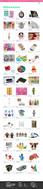

[![Contributors][contributors-shield]][contributors-url]
[![Forks][forks-shield]][forks-url]
[![Issues][issues-shield]][issues-url]

<!-- [![MIT License][license-shield]][license-url] -->

[![Stargazers][stars-shield]][stars-url]
[![GitHub Watchers][github-watchers]][github-watchers-url]

# Toystalgic

<!-- PROJECT LOGO -->
 

  

<h3 align="center">Toystalgic</h3>

  

    <!-- TEXT -->
     
    <a href="https://github.com/cdfoye/Toystalgic"><strong>Explore the Docs »</strong></a>
     
     
    <a href="https://toystalgic.herokuapp.com/">View Demo</a>
    ·
    <a href="https://github.com/cdfoye/Toystalgic/issues">Report Bug</a>
    ·
    <a href="https://github.com/cdfoye/Toystalgic/issues">Request Feature</a>
  

## Description:

GIVEN the Toystalgic homepage
 
WHERE I have options to view the listed toys and have the option to login
 
WHEN I choose login to Toystalgic
 
THEN I am shown a login interface to either login or an option to create a new profile
 
THEN I have access to the homepage and my own profile
 
WHEN I navigate to the homepage
 
THEN I am presented with a collection vintage toys
 
WHEN I navigate Order History
 
THEN I am presented with my previous orders
 
WHEN I navigate to the Forum
 
THEN I am taken to a forum to discuss vintage toys or similar topics
 
WHEN I navigate to About Me
 
THEN I am shown information on the creators of the application

## User Story

AS A collector
 
I WANT to buy and sell old nostalgic toys
 
SO THAT I can grow a collection and interact with other enthusiasts

(<a href="#top">back to top</a>)

## Application Features:

- Ability to view and purchase vintage toys
- Create profile to keep track of purchases
- User can post to forum to have conversations with other toy collectors
- View the creators of the application

(<a href="#top">back to top</a>)

## Application Appearance and Functionality:

Website's Appearance:

<!-- Add link to gif -->

### Built With

- [HTML](hhttps://www.w3schools.com/html/)
- [CSS](https://developer.mozilla.org/en-US/docs/Learn/CSS/First_steps/What_is_CSS)
- [Javascript](https://www.javascript.com)
- [EXPRESS](https://expressjs.com/)
- [REACT](https://reactjs.org/)
- [NODE.JS](https://nodejs.org/en/)
- [GRAPHQL](https://graphql.org/)
- [APOLLO](https://www.apollographql.com/)

(<a href="#top">back to top</a>)

## Project Link

[GitHub Repository](https://github.com/cdfoye/Toystalgic)

[Heroku Deployed Live Website](https://toystalgic.herokuapp.com/)

## Credits

List of Contributors:

1. Kelly Walsh
2. Catherine Foye
3. Cynthia Godoy
4. Aubree Zarges

## Contact Info

Kelly Walsh - kellywalsh827@gmail.com [![LinkedIn][linkedin-shield]][linkedin-url-kelly] [![GitHub][github-shield]][github-url-kelly]  
Catherine Foye - cdfoye@gmail.com [![LinkedIn][linkedin-shield]][linkedin-url-catherine] [![GitHub][github-shield]][github-url-catherine]  
Cynthia Godoy - cynthia@ck-interiors.com [![LinkedIn][linkedin-shield]][linkedin-url-cynthia] [![GitHub][github-shield]][github-url-cynthia]  
Aubree Zarges - aubreezarges@yahoo.com [![LinkedIn][linkedin-shield]][linkedin-url-aubree] [![GitHub][github-shield]][github-url-aubree]  

(<a href="#top">back to top</a>)

<!-- MARKDOWN LINKS & IMAGES -->
<!-- https://www.markdownguide.org/basic-syntax/#reference-style-links -->

[contributors-shield]: https://img.shields.io/github/contributors/cdfoye/Toystalgic.svg?style=for-the-badge
[contributors-url]: https://github.com/cdfoye/Toystalgic/graphs/contributors
[forks-shield]: https://img.shields.io/github/forks/cdfoye/Toystalgic.svg?style=for-the-badge
[forks-url]: https://github.com/cdfoye/Toystalgic/network/members
[stars-shield]: https://img.shields.io/github/stars/cdfoye/Toystalgic?style=social
[stars-url]: https://github.com/cdfoye/Toystalgic/stargazers
[issues-shield]: https://img.shields.io/github/issues/cdfoye/Toystalgic.svg?style=for-the-badge
[issues-url]: https://github.com/cdfoye/Toystalgic/issues
[license-shield]: https://img.shields.io/github/license/cdfoye/Toystalgic.svg?style=for-the-badge
[license-url]: https://github.com/cdfoye/Toystalgic/blob/main/LICENSE.txt
[linkedin-shield]: https://img.shields.io/badge/-LinkedIn-black.svg?style=for-the-badge&logo=linkedin&colorB=555
[linkedin-url-kelly]: https://www.linkedin.com/in/kellywalsh001/
[linkedin-url-catherine]: https://www.linkedin.com/in/catherine-foye/
[linkedin-url-cynthia]: https://www.linkedin.com/in/cynthia-godoy-ncidq-96951845/

<!-- [linkedin-url-aubree]: https://www.linkedin.com/in/aubreewardcs/ -->

[github-shield]: https://img.shields.io/badge/-Github-blueviolet.svg?style=for-the-badge&logo=Github&colorB=555
[github-url-kelly]: https://github.com/kemwalsh
[github-url-catherine]: https://github.com/cdfoye
[github-url-cynthia]: https://github.com/CynthiaGodoy
[github-url-aubree]: https://github.com/AubreeZ-G
[github-watchers]: https://img.shields.io/github/watchers/cdfoye/Toystalgic?style=social
[github-watchers-url]: https://github.com/cdfoye/Toystalgic/watchers
